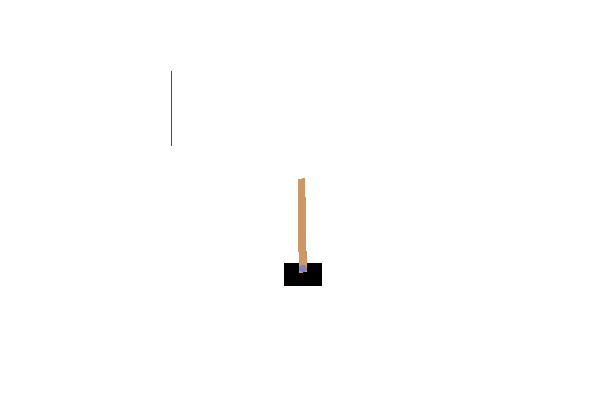
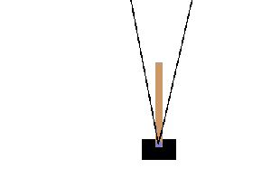

# Dyn Gym

This is a pip package implementing Reinforcement Learning algorithms in non-stationary environments supported by the <a href="https://gym.openai.com/">OpenAI Gym</a> toolkit.
It contains both the dynamic environments i.e. whose transition and reward functions depend on the time and some algorithms implementations.

# Environments

The implemented environments are the following and can be found at <i>dyna-gym/dyna_gym/envs</i>.
For each environment, the id given as argument to the gym.make function is writen in bold.

- <b>CartPoleDynamicTransition-v0</b>. A cart pole environment with a time-varying direction of the gravitational force;
<p align="center">
	
</p>
<p align="center">
	Cart pole in the <b>CartPoleDynamicTransition-v0</b> environment. The red bar indicates the direction of the gravitational force
</p>

- <b>CartPoleDynamicReward-v1</b>. A cart pole environment with a double objective: to balance the pole and to keep the position of the cart along the x-axis within a time-varying interval;
<p align="center">
	
	Cart pole in the <b>CartPoleDynamicReward-v1</b> environment. The two red dots correspond to the limiting interval.
</p>

- <b>CartPoleDynamicReward-v2</b>. A cart pole environment with a time-varying cone into which the pole should balance.
<p align="center">
	
	Cart pole in the <b>CartPoleDynamicReward-v2</b> environment. The two black lines correspond to the limiting angle interval.
</p>


# Algorithms

The implemented algorithms are the following and can be found at <i>dyna-gym/dyna_gym/agents</i>.
- Random action selection;
- <a href="http://ggp.stanford.edu/readings/uct.pdf">UCT algorithm</a>;
- <a href="https://arxiv.org/abs/1805.01367">OLUCT algorithm</a>;
- IQUCT (Infered Q-values UCT) algorithm.

# Installation

Type the following commands in order to install the package:

```bash
cd dyna-gym
pip install -e .
```

Examples are provided in the <i>example/</i> repository. You can run them using your
installed version of Python.

